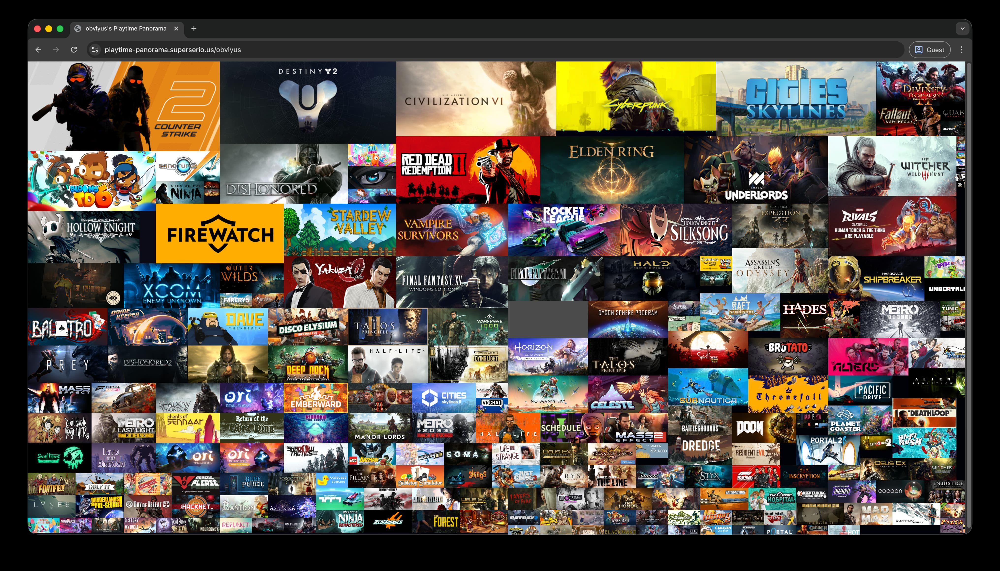

# playtime-panorama



Generate a dense, responsive collage of your Steam library where each header image tile is sized by the playtime.

## What the app does
- Fetches your publicly visible Steam playtime data (requires a Steam Web API key).
- Scales every game's header image by actual hours played, so long-haul favorites dominate the collage.
- Arranges the artwork into a responsive CSS grid that reflows to match any viewport size.

## Quick start
```bash
bun install
STEAM_API_KEY=ABCDEFGH... bun run dev
```

Visit `http://localhost:3000/<your-steam-id>` and the server will fetch, normalize, and render the responsive grid layout on the fly.

## How the packing logic works
The collage is laid out by `computeGridLayout` in `templates/profile.html`, and it behaves like a self-tuning CSS Grid packer:

- **Hours drive span weights.** Each game’s hours are transformed into an area weight using a softened power curve (`(hours + 0.1)^0.62`) so outliers still feel big without flattening mid-tier favorites. The largest weight sets the scale for every other tile.
- **Span-first sizing.** The algorithm starts with a target column count (based on viewport width and desired card width), computes a column width, and then converts the weighted area into square grid spans (from 1×1 up to a capped `maxSpan`). High-playtime titles claim larger spans; the top few entries are boosted to anchor the grid.
- **Height-aware column search.** Before locking a layout, the code estimates overall grid height. If the grid would overflow the viewport, it increases the column count; if it leaves too much empty space, it trims columns. This loop runs a handful of times so the final grid sits neatly in the visible stage.
- **Row sizing + CSS handoff.** With the chosen column count, `--columns` and `--row-size` are written to CSS variables, and the DOM simply flows cards into place. Hover states and tooltips are handled purely in CSS for smooth rendering.

Apart from a few type packages, this app uses NO external dependencies. Everything runs off of Bun's in-built APIs on the server and the frontend is intentionally a simple, HTML file without React or Tailwind. I wanted a performant, minimal dependency approach for this project.

Contributions are welcome!